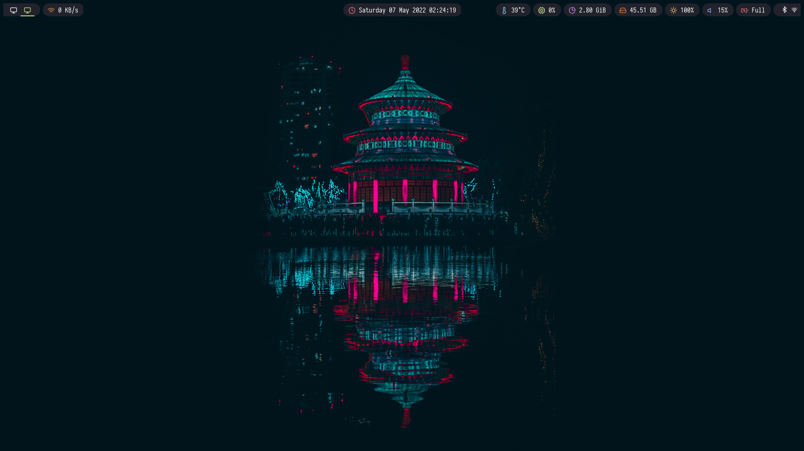
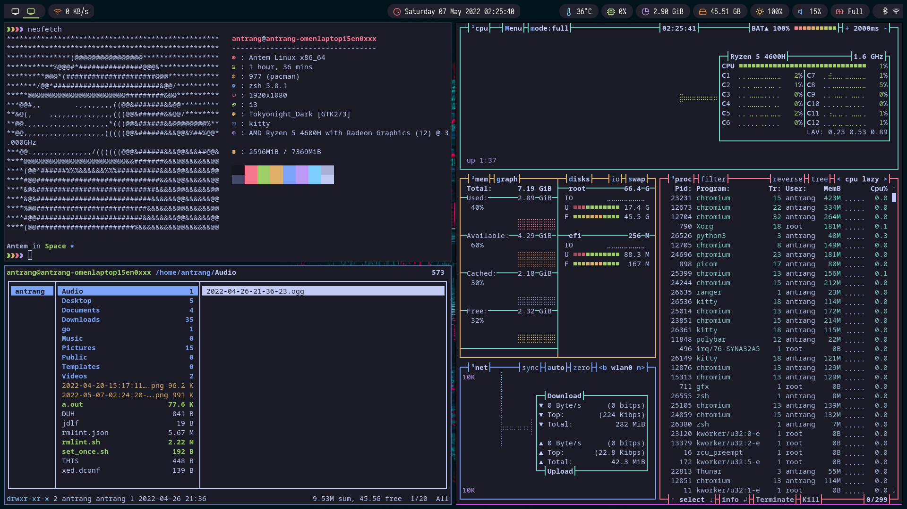
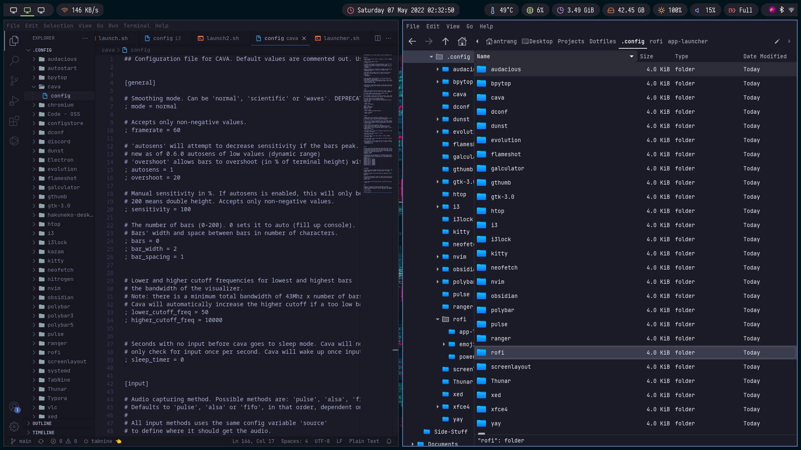
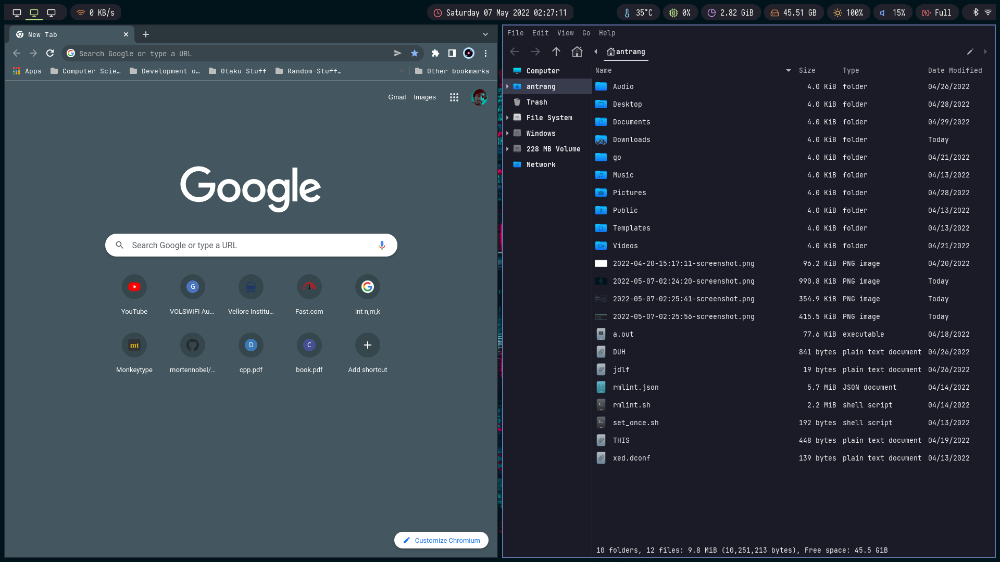

# Antem-Dotfiles

<h2 align="center"> ━━━━━━  ❖  ━━━━━━ </h2>

<h4 align="center">

        ░█████╗░███╗░░██╗████████╗███████╗███╗░░░███╗
        ██╔══██╗████╗░██║╚══██╔══╝██╔════╝████╗░████║
        ███████║██╔██╗██║░░░██║░░░█████╗░░██╔████╔██║
        ██╔══██║██║╚████║░░░██║░░░██╔══╝░░██║╚██╔╝██║
        ██║░░██║██║░╚███║░░░██║░░░███████╗██║░╚═╝░██║
        ╚═╝░░╚═╝╚═╝░░╚══╝░░░╚═╝░░░╚══════╝╚═╝░░░░░╚═╝

    ██████╗░░█████╗░████████╗███████╗██╗██╗░░░░░███████╗░██████╗
    ██╔══██╗██╔══██╗╚══██╔══╝██╔════╝██║██║░░░░░██╔════╝██╔════╝
    ██║░░██║██║░░██║░░░██║░░░█████╗░░██║██║░░░░░█████╗░░╚█████╗░
    ██║░░██║██║░░██║░░░██║░░░██╔══╝░░██║██║░░░░░██╔══╝░░░╚═══██╗
    ██████╔╝╚█████╔╝░░░██║░░░██║░░░░░██║███████╗███████╗██████╔╝
    ╚═════╝░░╚════╝░░░░╚═╝░░░╚═╝░░░░░╚═╝╚══════╝╚══════╝╚═════╝░

</h4>

   Thanks for dropping by! This is my personal repository of my dotfiles.

   Here are more information about my setup:

   - **OS:** [Arch Linux](https://archlinux.org)
   - **WM:** [i3wm](https://github.com/baskerville/bspwm)
   - **Terminal:** [kitty](https://github.com/alacritty/alacritty)
   - **Shell:** [zsh](https://www.zsh.org/)
   - **Compositor:** [picom](https://github.com/yshui/picom)
   - **Editor:** [neovim](https://github.com/neovim/neovim),[vscode](https://github.com/neovim/neovim), 
   - **Browser:** [firefox](https://www.mozilla.org/en-US/firefox),[chromium](https://github.com/neovim/neovim), 
   - **File Manager:** [thunar](https://github.com/xfce-mirror/thunar)
   - **Application Launcher:** [rofi](https://github.com/davatorium/rofi)
   - **fetch** [neofetch](https://github.com/davatorium/rofi)
   - **prompt** [starship](https://github.com/davatorium/rofi)
   

# Screenshots

   
    
   
    
   
    
   

 

# Acknoledgements

- **Inspiration**

    - [janeleigh](https://github.com/janleigh/dotfiles) for the README style.

- **Polybar**

    - [totoro-ghost](https://github.com/totoro-ghost/dotfiles) for the Polybar Config.
    - [adi1090x](https://github.com/adi1090x/rofi) for the rofi Config.

- **Contributors**

    - [Just Me](https://github.com/ant-6112)

         